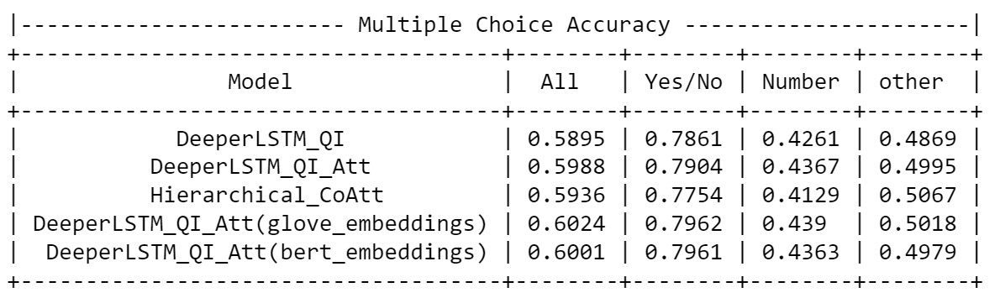

# VQA: Visual Question Answering System

This case study VQA is a task of free-form and open-ended Visual Question Answering (VQA). Given an image and a natural language question about the image, the task is to provide an accurate natural language answer. In this, we try to implement and analyse three deep learning models and compare them.

# Dataset

- Dataset source : www.visualqa.org/download
- Training annotations 2017 v2.0* : 4,437,570 answers Validation annotations 2017 v2.0* : 2,143,540 answers
- Training questions 2017 v2.0* : 443,757 questions Validation questions 2017 v2.0* : 214,354 questions
- Data format: Image folders containing .jpg images and json files consisting questions and answers.

# Real world Objectives and constraints
- Predict answers with decent accuracy.
- Output should be given within few seconds.

# Performance Metric:

Accuracy (Multi-Choice) : Its the ratio of no. of correct answers predicted to no. of total predictions. Multi-Choice is, any value predicted should be in the multichoice answers for that question .
Accuracy = no. of correct predictions / no. of total predictions.

# Deep Learning Models

We implemented, modified and analysed three models arXiv:1505.00468 [cs.CL] , arXiv:1704.03162 [cs.CV], arXiv:1606.00061 [cs.CV]
## DeeperLSTM_QI:

## DeeperLSTM_QI_Att: (used only attention mechanism from paper)

## Hierarchical_CoAtt:

# Results:

Below is the comparision table of all models implemented in this case study.

